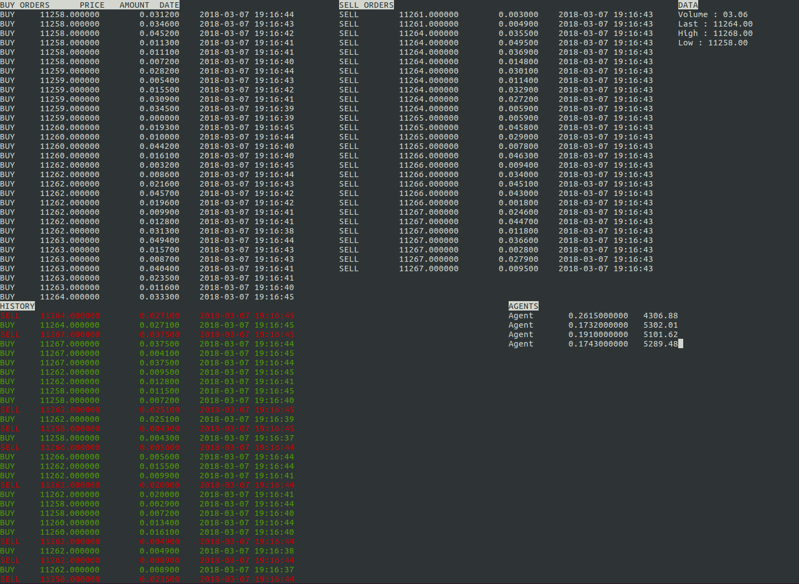

# AIPCloud Marketplace Simulator
This project is a simple demonstration of a crypto-currency exchange platform. In the future, this tool will be useful to develop trading bots on local servers before deploying them on online exchange platforms.

